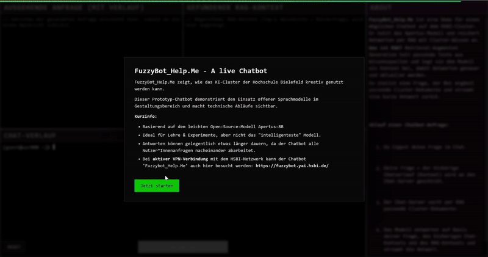
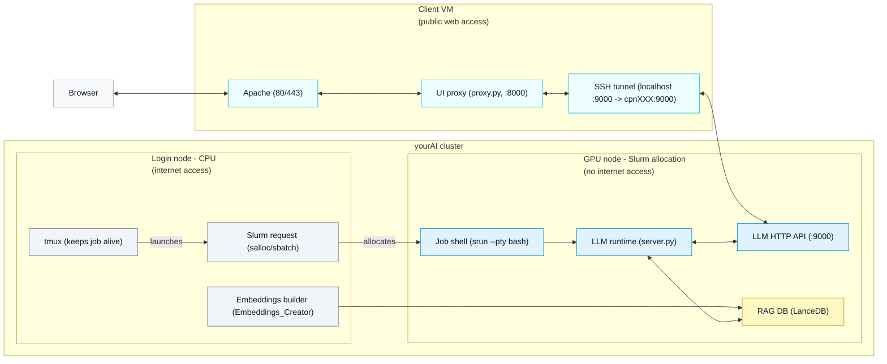
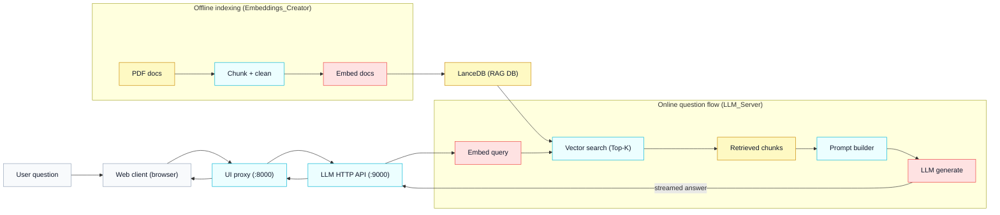

# FuzzyBot_HSBI

FuzzyBot_HSBI is an experiment in running a helpful chatbot on the Hochschule
Bielefeld (HSBI) GPU cluster and enriching it with cluster-specific knowledge.
The model is fed with embeddings built from local PDFs and the full RAG process
is visualized in a kiosk-style client (request payload, retrieved context, and
streaming answer).

Live demo (no backend):
[https://strangerattractor.github.io/FuzzyBot_HSBI/WebClient/client/?demo=1](https://strangerattractor.github.io/FuzzyBot_HSBI/WebClient/client/?demo=1)

<a href="https://strangerattractor.github.io/FuzzyBot_HSBI/WebClient/client/?demo=1">
  
</a>

*The console look is a deliberate aesthetic choice. I spent a lot of time
working in terminal sessions to make this work, and I wanted to keep a bit of
that feel for the user. The styling became so techy that some people assumed
it was a real console, even though it is only a visual metaphor.*

## Table of contents

- [At a glance](#at-a-glance)
- [Cluster access (HSBI + yourAI)](#cluster-access-hsbi--yourai)
- [Project layout (key files)](#project-layout-key-files)
- [Getting started (end-to-end)](#getting-started-end-to-end)
- [Configuration (common env vars)](#configuration-common-env-vars)
- [Architecture (cluster + VM)](#architecture-cluster--vm)
- [RAG flow (question -> embeddings -> LLM)](#rag-flow-question---embeddings---llm)
- [Runbooks](#runbooks)
- [Guides and sources](#guides-and-sources)
- [Placeholders used in docs](#placeholders-used-in-docs)
- [Models](#models)
- [Why Apertus](#why-apertus)
- [Credits](#credits)

## At a glance

- Login node (CPU): run tmux, request GPU via Slurm, build embeddings with
  `Embeddings_Creator/build_pdf_embeddings.py`.
- GPU node (Slurm allocation): run `LLM_Server/server.py` on port 9000.
- Client VM: serve `WebClient/client` via Apache and run `WebClient/server/proxy.py`
  on port 8000.
- The client shows request payloads, retrieved context, and the streaming answer.

The client is part of the experiment: it shows the full request payload, the
retrieved chunks, and the streamed response to make the system transparent.

## Cluster access (HSBI + yourAI)

This project runs on the Hochschule Bielefeld (HSBI) infrastructure and
references the yourAI project as the institutional AI/HPC offering for
research and teaching. The yourAI cluster provides GPU and CPU resources for
research and study projects. Public background:

- yourAI press release:
  [https://www.hsbi.de/presse/pressemitteilungen/rechenpower-fuer-ki-die-hsbi-bietet-forschenden-und-studierenden-mit-yourai-eine-leistungsfaehige-it-infrastruktur](https://www.hsbi.de/presse/pressemitteilungen/rechenpower-fuer-ki-die-hsbi-bietet-forschenden-und-studierenden-mit-yourai-eine-leistungsfaehige-it-infrastruktur)

Cluster access:
- HSBI DVZ / IT-Services entry point for access requests:
  [https://www.hsbi.de/dvz/it-services](https://www.hsbi.de/dvz/it-services)

- yourAI access portal (login required):
  [https://ood.yai.hsbi.de/pun/sys/dashboard/](https://ood.yai.hsbi.de/pun/sys/dashboard/)

Access is typically granted to HSBI members and project partners via the DVZ
service desk. The portal link above requires an HSBI login.

## Project layout (key files)

```text
FuzzyBot_HSBI/
|-- LLM_Server/
|   `-- server.py                # LLM API + RAG runtime (GPU node)
|-- Embeddings_Creator/
|   `-- build_pdf_embeddings.py  # PDF -> chunks -> LanceDB (login node)
|-- WebClient/
|   |-- client/                  # UI (served by Apache on VM)
|   |   |-- index.html
|   |   |-- app.js
|   |   `-- styles.css
|   `-- server/
|       `-- proxy.py             # UI proxy (VM or local)
|-- env/
|   |-- requirements-llm-server.txt
|   `-- requirements-vm.txt
|-- docs/                        # Runbooks + ops docs
`-- Models/
    `-- README.md                # model download notes
```

Primary entry points: `LLM_Server/server.py`, `Embeddings_Creator/build_pdf_embeddings.py`,
`WebClient/server/proxy.py`.

## Getting started (end-to-end)

1) Build embeddings. See [docs/RUNBOOK_embeddings_creator.md](docs/RUNBOOK_embeddings_creator.md).
2) Start the model server (GPU node). See [docs/RUNBOOK_run_llm_server_on_cluster.md](docs/RUNBOOK_run_llm_server_on_cluster.md).
3) Start the UI proxy (client VM or local machine):

If you have an SSH tunnel to the GPU node on port 9000, you can run the proxy
locally and point it at `http://127.0.0.1:9000`.

```bash
cd WebClient/server
export APERTUS_URL="http://127.0.0.1:9000"
export PROXY_PORT=8000
python proxy.py
```

Open `http://127.0.0.1:8000` in a browser.

## Configuration (common env vars)

These environment variables are used in the server and client.

Model:
- `FUZZYBOT_MODELS_DIR` (base model dir, default: `./Models`)
- `FUZZYBOT_MODEL_NAME` (default: `Apertus-8B-Instruct-2509`)
- `APERTUS_MODEL_DIR` (overrides both)

RAG DB:
- `FUZZYBOT_DB_DIR` (base DB dir, default: `./LLM_Server/rag/db`)
- `EMBEDDING_DB_URI` (overrides `FUZZYBOT_DB_DIR`)
- `EMBEDDING_TABLE_NAME` (default: `pdf_chunks`)
- `EMBEDDING_MODEL_PATH` (default: `sentence-transformers/all-MiniLM-L6-v2`)
- `RAG_TOP_K`, `RAG_MAX_CHARS`, `RAG_DEBUG`

Server:
- `APERTUS_HOST` (default: `0.0.0.0`)
- `APERTUS_PORT` (default: `9000`)

UI proxy:
- `APERTUS_URL` (default: `http://127.0.0.1:9000`)
- `PROXY_PORT` (default: `8000`)

## Architecture (cluster + VM)



## RAG flow (question -> embeddings -> LLM)



## Runbooks

- [docs/RUNBOOK_installation.md](docs/RUNBOOK_installation.md)
- [docs/RUNBOOK_main.md](docs/RUNBOOK_main.md)
- [docs/RUNBOOK_run_llm_server_on_cluster.md](docs/RUNBOOK_run_llm_server_on_cluster.md)
- [docs/RUNBOOK_embeddings_creator.md](docs/RUNBOOK_embeddings_creator.md)
- [docs/VM_STRUCTURE.md](docs/VM_STRUCTURE.md)
- [docs/TOOLS_tmux_slurm.md](docs/TOOLS_tmux_slurm.md)

## Guides and sources

- [docs/CLUSTER_GUIDE_GENERAL_DE.md](docs/CLUSTER_GUIDE_GENERAL_DE.md) (general HPC + AI cluster guide used for embeddings)
- [docs/YourAI_Manual_extracted.txt](docs/YourAI_Manual_extracted.txt) (yourAI manual text extract from a scan)

## Placeholders used in docs

- `<USER>`: cluster username
- `<ACCOUNT>`: Slurm account / project allocation
- `<QOS>`: Slurm QOS
- `cpnXXX`: GPU node name

## Models

Default model: `Apertus-8B-Instruct-2509`.

Download, install, and swap steps (including the 4-bit variant) live in
[docs/RUNBOOK_installation.md](docs/RUNBOOK_installation.md).

## Why Apertus

- Open source, European, locally hostable.
- Fits the on-premise cluster model without external dependencies.
- I do not run the largest model for this test; I picked a smaller model for
  efficiency and GPU fit.
- This setup can run larger models across multiple GPUs when needed.

I tested multiple Apertus sizes; at the time of documentation, this was the
best size-to-GPU fit. I also tested DeepSeek and saw better reasoning quality,
but I wanted to evaluate Apertus as the primary open model. I do not use Meta
models for ethical reasons (policy choices I do not support).

## Credits

Dr. Matthias Fricke provided extensive support with cluster access, VM setup,
Apache reverse proxy configuration, and operations checks that made the
deployment stable.
